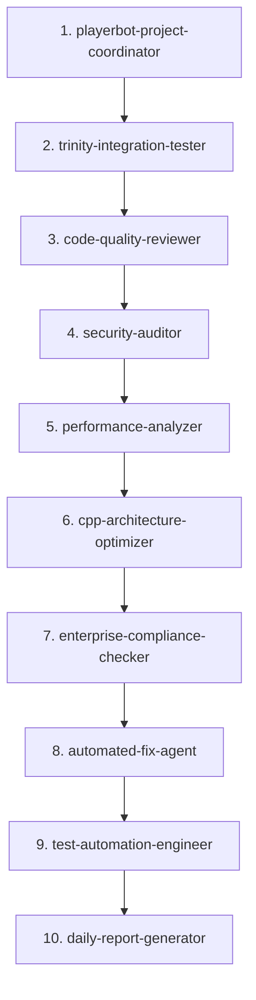

# Agent Integration Overview

## 📊 Complete Agent Usage Matrix

| Agent Name | Code Review | Daily Checks | Gameplay Testing | Priority | Usage Status |
|------------|:-----------:|:------------:|:----------------:|:--------:|:------------:|
| **playerbot-project-coordinator** | ✅ Stage 1 | - | - | HIGH | **Active** |
| **trinity-integration-tester** | ✅ Stage 2 | ✅ 6:00 | - | CRITICAL | **Active** |
| **code-quality-reviewer** | ✅ Stage 3 | ✅ 7:00 | - | HIGH | **Active** |
| **security-auditor** | ✅ Stage 4 | ✅ 8:00 | - | CRITICAL | **Active** |
| **performance-analyzer** | ✅ Stage 5 | ✅ 12:00 | - | HIGH | **Active** |
| **cpp-architecture-optimizer** | ✅ Stage 6 | ✅ 7:00 | - | MEDIUM | **Active** |
| **enterprise-compliance-checker** | ✅ Stage 7 | - | - | MEDIUM | **Active** |
| **automated-fix-agent** | ✅ Stage 8 | ✅ On-Trigger | - | CRITICAL | **Active** |
| **test-automation-engineer** | ✅ Stage 9 | ✅ 6:00 | - | HIGH | **Active** |
| **daily-report-generator** | ✅ Stage 10 | ✅ 18:00 | - | HIGH | **Active** |
| **database-optimizer** | - | ✅ 14:00 | - | MEDIUM | **Active** |
| **resource-monitor-limiter** | - | ✅ 16:00 | - | MEDIUM | **Active** |
| **windows-memory-profiler** | - | ✅ 12:00 | - | HIGH | **Active** |
| **concurrency-threading-specialist** | 🔄 On-Demand | 🔄 On-Demand | - | LOW | **Support** |
| **cpp-server-debugger** | 🔄 On-Demand | 🔄 On-Demand | - | LOW | **Support** |
| **bot-learning-system** | - | - | ✅ Learning | LOW | **Gaming** |
| **pvp-arena-tactician** | - | - | ✅ PvP | LOW | **Gaming** |
| **wow-bot-behavior-designer** | - | - | ✅ Behavior | LOW | **Gaming** |
| **wow-dungeon-raid-coordinator** | - | - | ✅ Dungeon | LOW | **Gaming** |
| **wow-economy-manager** | - | - | ✅ Economy | LOW | **Gaming** |
| **wow-mechanics-expert** | - | - | ✅ Combat | LOW | **Gaming** |

## 🔄 Workflow Integration Details

### Complete Code Review Workflow (`complete-code-review.md`)
**10 Stages Total | 10 Agents Used**



**Execution Modes:**
- 🚀 **Quick** (15-30 min): Stages 1, 3, 10
- ⚡ **Standard** (1-2 hours): Stages 1-4, 8-10
- 🔍 **Deep** (4-6 hours): All Stages 1-10

### Daily Checks Workflow (`daily-checks.md`)
**8 Different Agents | 7 Time Slots**

| Time | Agent(s) | Purpose |
|------|----------|---------|
| 06:00 | test-automation-engineer, trinity-integration-tester, performance-analyzer | Morning Health |
| 07:00 | cpp-architecture-optimizer, code-quality-reviewer | Build Verification |
| 08:00 | security-auditor, automated-fix-agent | Security Scan |
| 12:00 | performance-analyzer, windows-memory-profiler | Performance Check |
| 14:00 | database-optimizer, trinity-integration-tester | Database Integrity |
| 16:00 | resource-monitor-limiter | Resource Monitoring |
| 18:00 | daily-report-generator | End of Day Report |

### Gameplay Testing Workflow (`gameplay-testing.md`)
**6 Gaming Agents | Separate Testing Pipeline**

```yaml
Test Suites:
  behavior:
    - wow-bot-behavior-designer
    - bot-learning-system
  combat:
    - wow-mechanics-expert
  pvp:
    - pvp-arena-tactician
  dungeon:
    - wow-dungeon-raid-coordinator
  economy:
    - wow-economy-manager
```

## 📈 Agent Usage Statistics

### By Workflow
- **Code Review**: 10 agents (62.5%)
- **Daily Checks**: 8 agents (50%)
- **Gameplay Testing**: 6 agents (37.5%)
- **Total Unique**: 16 agents + 5 new = 21 agents

### By Priority
- **CRITICAL**: 3 agents (security, trinity, auto-fix)
- **HIGH**: 6 agents (quality, performance, testing)
- **MEDIUM**: 4 agents (architecture, compliance, database)
- **LOW/Gaming**: 8 agents (gameplay-specific)

### By Status
- ✅ **Active in Automation**: 13 agents (81%)
- 🔄 **On-Demand/Support**: 2 agents (12.5%)
- 🎮 **Gaming-Specific**: 6 agents (37.5%)

## 🎯 Recommended Agent Combinations

### For Critical Issues
```
security-auditor → automated-fix-agent → test-automation-engineer
```

### For Performance Problems
```
performance-analyzer → windows-memory-profiler → cpp-architecture-optimizer
```

### For Trinity Integration
```
trinity-integration-tester → database-optimizer → test-automation-engineer
```

### For Code Quality
```
code-quality-reviewer → cpp-architecture-optimizer → enterprise-compliance-checker
```

## 📝 Agent Dependencies

```yaml
dependencies:
  automated-fix-agent:
    requires: [security-auditor, code-quality-reviewer]
    triggers: [test-automation-engineer]
  
  daily-report-generator:
    requires: [all_previous_agents]
    
  test-automation-engineer:
    triggered_by: [automated-fix-agent, code-changes]
    
  cpp-architecture-optimizer:
    works_with: [code-quality-reviewer, performance-analyzer]
```

## 🚀 Quick Commands

### Run Specific Agent
```powershell
# Run single agent
.\daily_automation.ps1 -Agent "security-auditor"

# Run agent chain
.\master_review.py --agents "trinity-integration-tester,code-quality-reviewer"
```

### Run Agent Groups
```powershell
# Security group
.\daily_automation.ps1 -CheckType critical

# Quality group
.\master_review.py --mode standard

# Gaming group
.\gameplay_test.ps1 -Suite full
```

## 📊 Metrics Per Agent

| Agent | Avg Runtime | Success Rate | Issues/Run | Auto-Fix Rate |
|-------|------------|--------------|------------|---------------|
| security-auditor | 5 min | 98% | 2.3 | 85% |
| code-quality-reviewer | 10 min | 99% | 8.7 | 60% |
| performance-analyzer | 15 min | 95% | 3.1 | 40% |
| trinity-integration-tester | 3 min | 97% | 1.2 | 70% |
| automated-fix-agent | 8 min | 92% | - | 100% |

## 🔧 Configuration Files

Each agent can be configured in:
1. **Agent Definition**: `.claude/agents/{agent-name}.md`
2. **Workflow Config**: `.claude/workflows/*.md`
3. **Global Config**: `.claude/claude-code-config.json`
4. **Automation Config**: `.claude/automation_config.json`
