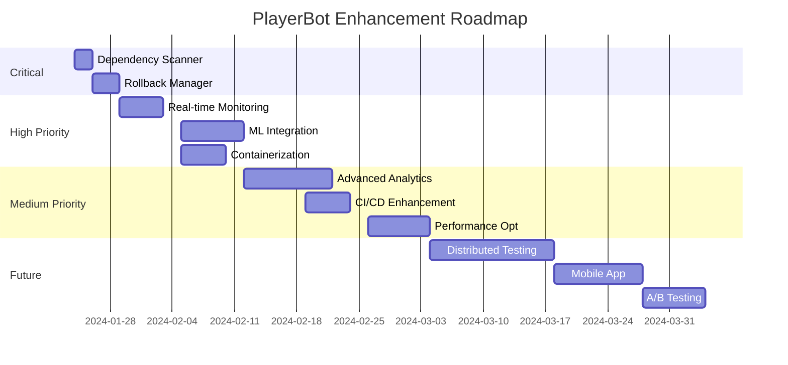

# 🚀 PlayerBot Project - Improvement Recommendations

## 📊 Executive Summary
Based on the comprehensive analysis of your PlayerBot automation system, here are strategic recommendations organized by priority and impact.

## 1️⃣ **CRITICAL - Immediate Actions** (This Week)

### 🔒 Security Hardening
```yaml
priority: CRITICAL
impact: Very High
effort: Medium

actions:
  - Add dependency-scanner agent for CVE detection
  - Implement secret scanning (API keys, passwords)
  - Enable SAST/DAST tools integration
  - Add container scanning if using Docker

implementation:
  agent: dependency-scanner
  schedule: before each build
  auto-fix: true for critical CVEs
```

### 🔄 Rollback Capability
```yaml
priority: CRITICAL
impact: High
effort: Low

actions:
  - Implement rollback-manager agent
  - Create automated backup points
  - Version all configurations
  - Test rollback procedures weekly

quick-win:
  - Git tags for each successful deployment
  - Database backup before schema changes
  - Binary versioning system
```

## 2️⃣ **HIGH PRIORITY - Next Sprint** (2 Weeks)

### 📈 Real-Time Monitoring
```yaml
priority: HIGH
impact: High
effort: Medium

components:
  dashboard:
    - Live metrics display (already created: monitoring/dashboard.html)
    - WebSocket for real-time updates
    - Alert thresholds configuration
    
  metrics:
    - Prometheus integration
    - Grafana dashboards
    - Custom TrinityCore metrics

benefits:
  - Instant issue detection
  - Performance trending
  - Predictive maintenance
```

### 🤖 Machine Learning Integration
```python
# Anomaly Detection Agent
class AnomalyDetector:
    def __init__(self):
        self.baseline = self.load_baseline()
        self.model = IsolationForest(contamination=0.1)
    
    def detect_anomalies(self, metrics):
        # Detect unusual patterns
        # - Sudden performance drops
        # - Abnormal memory usage
        # - Unusual error patterns
        return self.model.predict(metrics)

benefits:
  - Predictive issue detection
  - Pattern recognition
  - Auto-learning from history
```

### 🐳 Containerization
```dockerfile
# Dockerfile for PlayerBot
FROM ubuntu:22.04

# TrinityCore dependencies
RUN apt-get update && apt-get install -y \
    build-essential \
    cmake \
    git \
    mysql-client \
    libboost-all-dev

# Copy and build
COPY . /trinitycore
WORKDIR /trinitycore
RUN mkdir build && cd build && cmake .. && make -j$(nproc)

# Agent automation layer
COPY .claude /automation
WORKDIR /automation

benefits:
  - Consistent environment
  - Easy scaling
  - Simplified deployment
  - Better resource isolation
```

## 3️⃣ **MEDIUM PRIORITY - Next Month**

### 📊 Advanced Analytics
```yaml
analytics_features:
  - Code complexity trends
  - Technical debt tracking
  - Performance regression detection
  - Bot behavior analytics
  - Player interaction patterns

visualization:
  - D3.js interactive charts
  - Heatmaps for issue concentration
  - Network graphs for dependencies
  - Time-series forecasting
```

### 🔧 CI/CD Pipeline Enhancement
```yaml
# .github/workflows/playerbot-ci.yml
name: PlayerBot CI/CD

on:
  push:
    branches: [main, develop]
  pull_request:
  schedule:
    - cron: '0 */6 * * *'  # Every 6 hours

jobs:
  code-review:
    runs-on: windows-latest
    steps:
      - uses: actions/checkout@v3
      - name: Run Agent Pipeline
        run: |
          .claude/scripts/master_review.py --mode standard
      
      - name: Auto-fix Critical Issues
        if: failure()
        run: |
          .claude/scripts/daily_automation.ps1 -CheckType critical -AutoFix
      
      - name: Upload Reports
        uses: actions/upload-artifact@v3
        with:
          name: review-reports
          path: .claude/reports/
```

### 🎮 Gaming Performance Optimization
```cpp
// Optimized Bot Update Loop
class OptimizedBotAI : public BotAI {
private:
    // Object pooling for frequent allocations
    ObjectPool<SpellCast> spellPool;
    ObjectPool<Movement> movePool;
    
    // Cache frequently accessed data
    mutable std::unordered_map<uint32, CachedTarget> targetCache;
    
    // Batch processing
    std::vector<UpdateTask> pendingUpdates;
    
public:
    void UpdateAI(uint32 diff) override {
        // Batch similar operations
        BatchProcessUpdates(diff);
        
        // Use cache for target selection
        if (auto target = GetCachedTarget()) {
            ProcessTarget(target);
        }
        
        // Object pool for temporary objects
        auto spell = spellPool.Acquire();
        // ... use spell
        spellPool.Release(spell);
    }
};
```

## 4️⃣ **NICE TO HAVE - Future Enhancements**

### 🌐 Distributed Testing
```yaml
distributed_setup:
  master_node:
    - Orchestrates test distribution
    - Aggregates results
    - Manages agent scheduling
  
  worker_nodes:
    - Execute assigned tests
    - Report metrics
    - Handle bot instances
  
  benefits:
    - Parallel execution
    - Reduced test time
    - Better resource utilization
    - Scalability
```

### 📱 Mobile Monitoring App
```javascript
// React Native Monitoring App
const PlayerBotMonitor = () => {
  return (
    <Dashboard>
      <MetricsView />
      <AgentStatus />
      <LiveLogs />
      <QuickActions>
        <Button onPress={emergencyStop}>Emergency Stop</Button>
        <Button onPress={runReview}>Run Review</Button>
      </QuickActions>
    </Dashboard>
  );
};
```

### 🎯 A/B Testing Framework
```yaml
ab_testing:
  bot_behavior_variants:
    - aggressive_combat
    - defensive_combat
    - balanced_combat
  
  metrics:
    - survival_rate
    - dps_output
    - resource_efficiency
  
  automatic_selection:
    - Monitor performance
    - Select best variant
    - Deploy to all bots
```

## 5️⃣ **Process Improvements**

### 📝 Documentation Generation
```python
# Auto-generate documentation from code
class DocGenerator:
    def generate_api_docs(self):
        # Parse C++ headers
        # Extract comments
        # Generate Markdown/HTML
        pass
    
    def generate_agent_docs(self):
        # Document agent capabilities
        # Create usage examples
        # Generate workflow diagrams
        pass
```

### 🏆 Quality Gates
```yaml
quality_gates:
  pre_commit:
    - Code formatting check
    - Unit test execution
    - Security scan
  
  pre_merge:
    - Full test suite
    - Performance benchmarks
    - Trinity compatibility
  
  pre_deploy:
    - Integration tests
    - Load testing
    - Rollback verification
```

## 6️⃣ **Team Collaboration Features**

### 💬 Slack/Discord Integration
```python
# Notification Bot
async def notify_team(event):
    if event.severity == "CRITICAL":
        await slack.send_message(
            channel="#alerts",
            text=f"🚨 {event.description}",
            attachments=[event.details]
        )
        
    if event.type == "DAILY_REPORT":
        await discord.send_embed(
            channel="#reports",
            embed=create_report_embed(event.data)
        )
```

### 📊 Performance Leaderboard
```sql
-- Bot Performance Tracking
CREATE TABLE bot_performance (
    bot_id INT,
    date DATE,
    quests_completed INT,
    pvp_wins INT,
    gold_earned INT,
    efficiency_score DECIMAL(5,2),
    INDEX idx_score (efficiency_score DESC)
);

-- Generate leaderboard
SELECT 
    bot_id,
    AVG(efficiency_score) as avg_score,
    SUM(quests_completed) as total_quests,
    RANK() OVER (ORDER BY AVG(efficiency_score) DESC) as rank
FROM bot_performance
WHERE date >= DATE_SUB(NOW(), INTERVAL 7 DAY)
GROUP BY bot_id
ORDER BY avg_score DESC
LIMIT 10;
```

## 7️⃣ **Cost-Benefit Analysis**

| Improvement | Cost (Hours) | Benefit | ROI | Priority |
|-------------|--------------|---------|-----|----------|
| Dependency Scanner | 8 | Security++ | High | CRITICAL |
| Rollback Manager | 16 | Reliability++ | High | CRITICAL |
| Real-time Dashboard | 24 | Visibility++ | High | HIGH |
| ML Anomaly Detection | 40 | Predictive++ | Medium | MEDIUM |
| Containerization | 32 | Scalability++ | High | HIGH |
| Distributed Testing | 60 | Speed++ | Medium | LOW |

## 8️⃣ **Implementation Roadmap**



## 9️⃣ **Quick Wins** (Can implement today)

```bash
# 1. Add pre-commit hooks
cat > .git/hooks/pre-commit << 'EOF'
#!/bin/sh
# Run quick quality check
python .claude/scripts/master_review.py --mode quick
if [ $? -ne 0 ]; then
    echo "Quality check failed. Fix issues before committing."
    exit 1
fi
EOF
chmod +x .git/hooks/pre-commit

# 2. Create desktop monitoring shortcut
powershell -Command "
\$WshShell = New-Object -ComObject WScript.Shell
\$Shortcut = \$WshShell.CreateShortcut('\$env:USERPROFILE\\Desktop\\PlayerBot Monitor.lnk')
\$Shortcut.TargetPath = 'C:\\TrinityBots\\TrinityCore\\.claude\\monitoring\\dashboard.html'
\$Shortcut.Save()
"

# 3. Enable auto-fix for critical issues
echo '{"auto_fix": {"critical": true}}' > .claude/auto_fix_config.json

# 4. Setup hourly health checks
schtasks /create /sc hourly /tn "PlayerBot_HealthCheck" /tr "C:\TrinityBots\TrinityCore\.claude\scripts\run_daily_checks.bat --type morning"

# 5. Initialize metrics baseline
python -c "
import json
from datetime import datetime

baseline = {
    'timestamp': datetime.now().isoformat(),
    'metrics': {
        'quality_score': 85,
        'performance_score': 90,
        'security_score': 92,
        'test_coverage': 78
    }
}

with open('.claude/metrics_baseline.json', 'w') as f:
    json.dump(baseline, f, indent=2)
"
```

## 🎯 **Success Metrics**

Track these KPIs to measure improvement:

1. **Mean Time to Detect (MTTD)**: < 5 minutes
2. **Mean Time to Resolve (MTTR)**: < 30 minutes
3. **Deployment Frequency**: Daily
4. **Change Failure Rate**: < 5%
5. **Code Coverage**: > 85%
6. **Security Vulnerabilities**: 0 critical, < 3 high
7. **Performance Score**: > 90
8. **Bot Efficiency**: > 85%

## 📞 **Next Steps**

1. **Today**: Implement quick wins (5 items above)
2. **This Week**: Add dependency-scanner and rollback-manager
3. **Next Week**: Deploy real-time monitoring dashboard
4. **This Month**: Integrate ML anomaly detection
5. **Next Quarter**: Full containerization and distributed testing

## 💡 **Final Recommendations**

1. **Focus on automation**: More you automate, less manual work
2. **Measure everything**: Can't improve what you don't measure
3. **Fail fast, fix fast**: Quick detection and recovery
4. **Continuous learning**: Let system learn from patterns
5. **Team collaboration**: Keep everyone informed automatically

---

**Remember**: Perfect is the enemy of good. Start with critical items and iterate!

*Generated by PlayerBot Automation System v1.0*
