# PlayerBot Game Systems - Implementation Diagrams
## Comprehensive UML and Sequence Diagrams

## 1. Class Hierarchy Diagram

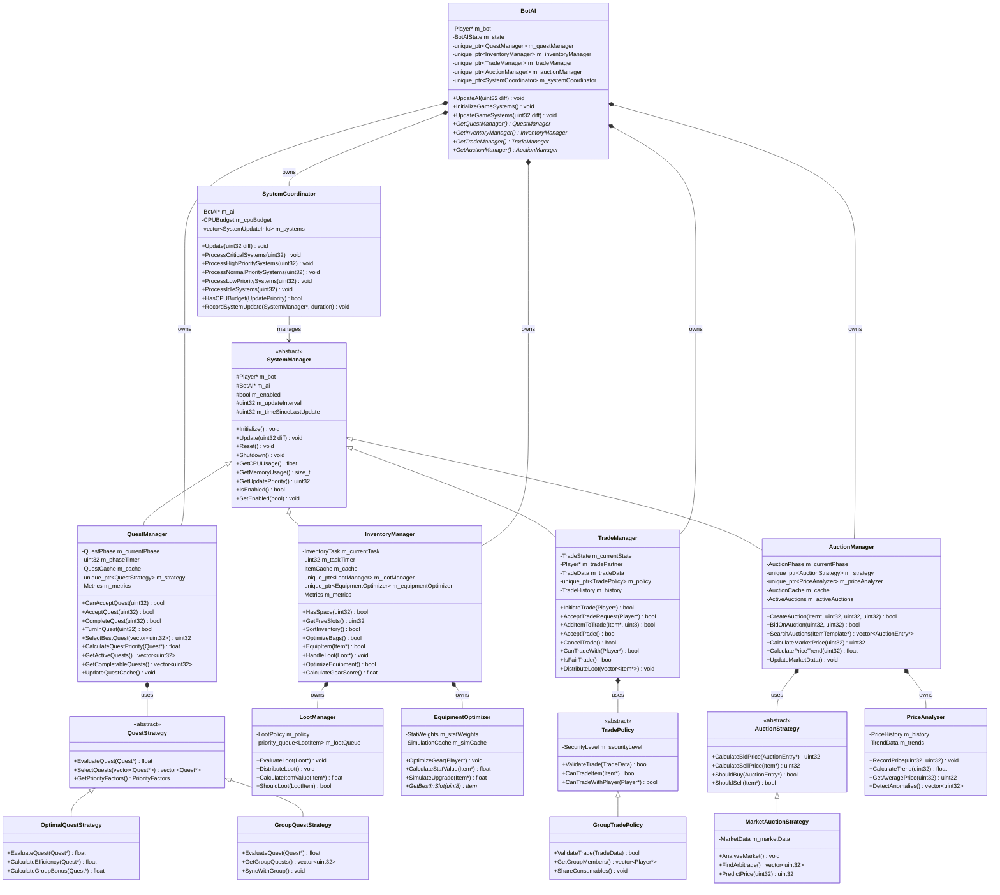

## 2. Component Interaction Diagram

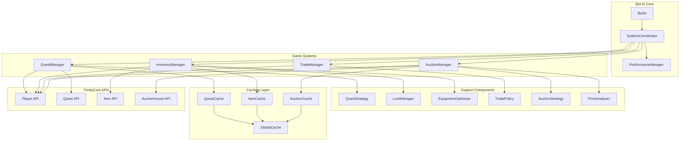

## 3. Quest System Sequence Diagram

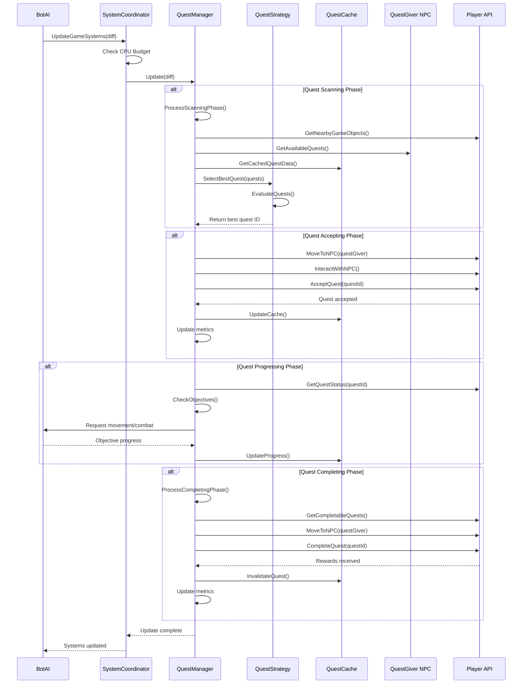

## 4. Inventory System Sequence Diagram

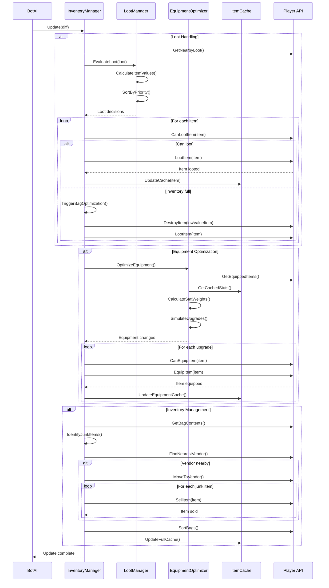

## 5. Trade System Sequence Diagram

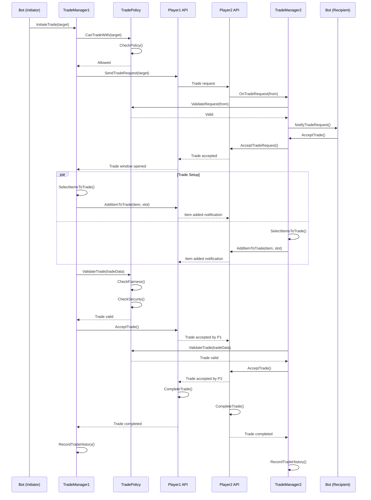

## 6. Auction System Sequence Diagram

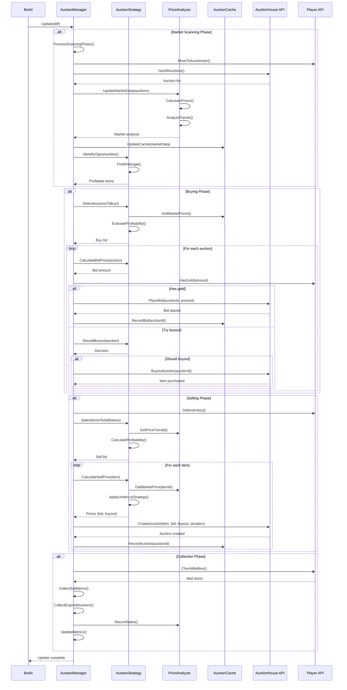

## 7. System Coordination Flow Diagram

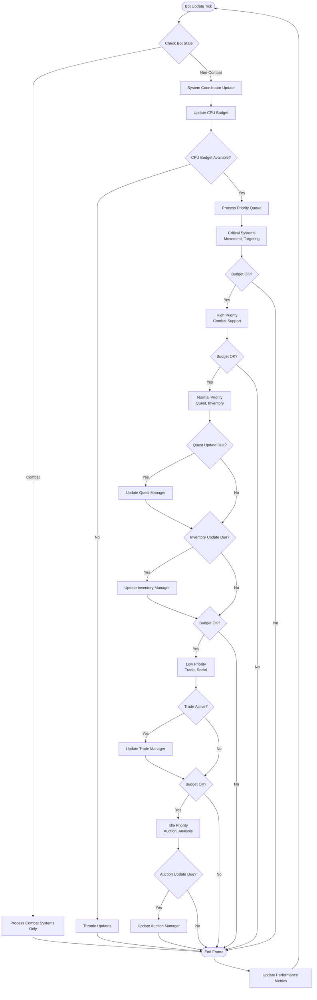

## 8. Memory Management Architecture

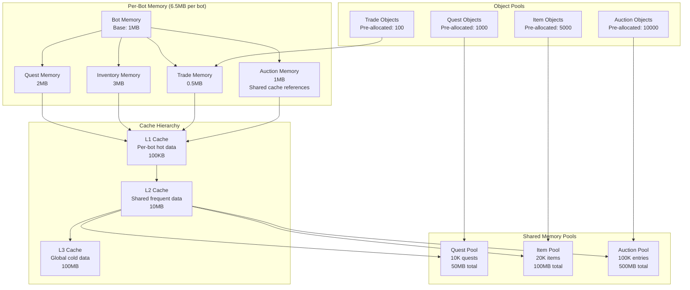

## 9. Error Handling State Machine

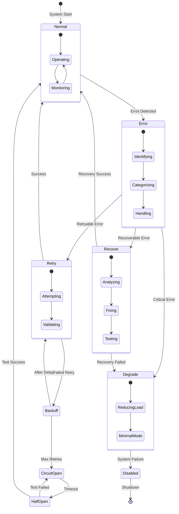

## 10. Performance Monitoring Dashboard

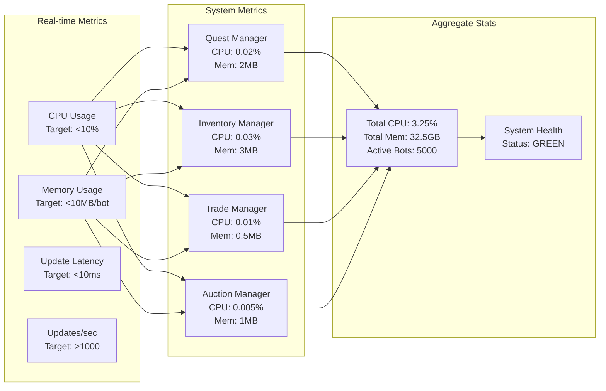

## 11. Database Access Pattern

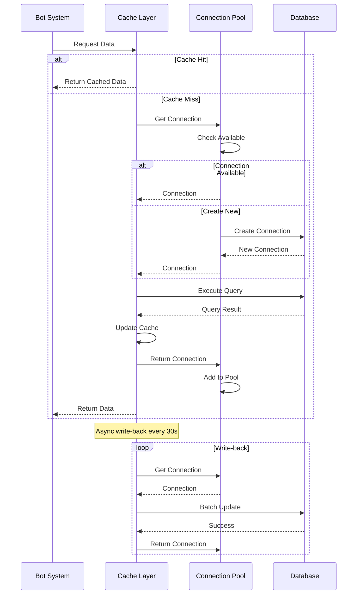

## 12. Integration Test Workflow

```mermaid
flowchart TD
    Start([Start Integration Test])

    Start --> Setup[Setup Test Environment]
    Setup --> Spawn[Spawn Test Bots<br/>100, 500, 1000, 5000]

    Spawn --> Phase1[Phase 1: Individual Systems]

    Phase1 --> TestQuest[Test Quest System]
    TestQuest --> QuestMetrics[Measure:<br/>- Quest acceptance rate<br/>- Completion time<br/>- CPU usage]

    QuestMetrics --> TestInv[Test Inventory System]
    TestInv --> InvMetrics[Measure:<br/>- Loot handling speed<br/>- Equipment optimization<br/>- Memory usage]

    InvMetrics --> TestTrade[Test Trade System]
    TestTrade --> TradeMetrics[Measure:<br/>- Trade completion rate<br/>- Security validation<br/>- Latency]

    TradeMetrics --> TestAuction[Test Auction System]
    TestAuction --> AuctionMetrics[Measure:<br/>- Market scan time<br/>- Bid success rate<br/>- Cache efficiency]

    AuctionMetrics --> Phase2[Phase 2: System Integration]

    Phase2 --> TestCombined[Run All Systems Together]
    TestCombined --> CombinedMetrics[Measure:<br/>- Total CPU usage<br/>- Memory footprint<br/>- Update coordination]

    CombinedMetrics --> Phase3[Phase 3: Stress Testing]

    Phase3 --> StressTest[5000 Bot Stress Test]
    StressTest --> StressMetrics[Measure:<br/>- System stability<br/>- Performance degradation<br/>- Error rates]

    StressMetrics --> Phase4[Phase 4: Failure Testing]

    Phase4 --> FailureTest[Inject Failures]
    FailureTest --> Recovery[Test Recovery:<br/>- Error handling<br/>- Circuit breakers<br/>- Graceful degradation]

    Recovery --> Validation{All Tests Pass?}

    Validation -->|Yes| Report[Generate Report]
    Validation -->|No| Debug[Debug Failures]

    Debug --> Fix[Fix Issues]
    Fix --> Phase1

    Report --> Complete([Testing Complete])
```

## Implementation Notes

### Critical Success Factors

1. **Performance Optimization**
   - Aggressive caching at all levels
   - Object pooling for frequent allocations
   - Lock-free data structures where possible
   - Batch database operations

2. **Scalability Design**
   - Linear scaling to 5000+ bots
   - Shared immutable data structures
   - Per-bot memory isolation
   - CPU budget enforcement

3. **Error Resilience**
   - Comprehensive error handling
   - Circuit breaker patterns
   - Graceful degradation
   - Automatic recovery mechanisms

4. **Testing Strategy**
   - Unit tests for each component
   - Integration tests for system interactions
   - Stress tests for 5000 bot scenarios
   - Failure injection testing

5. **Monitoring & Metrics**
   - Real-time performance tracking
   - System health monitoring
   - Automatic alerting on degradation
   - Detailed logging for debugging

These diagrams provide a comprehensive view of the system architecture, interactions, and implementation details necessary for building the enterprise-grade PlayerBot game system integration.